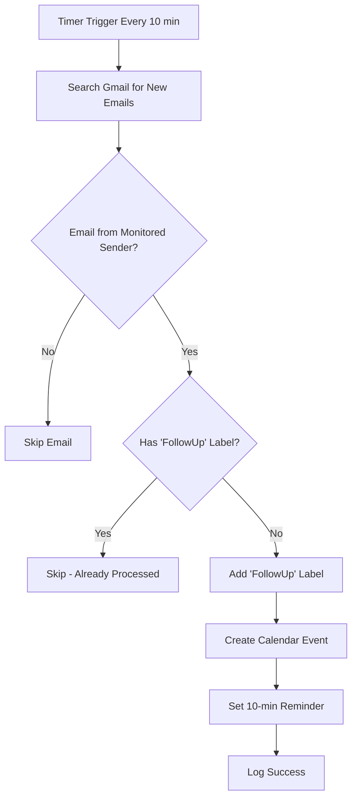

# Gmail to Calendar Follow-up Automation

🚀 **Automate your email follow-ups with Google Apps Script**

This Google Apps Script automatically monitors your Gmail inbox for emails from specific senders and creates calendar events for follow-up reminders. Perfect for staying on top of important communications without manual intervention.

## ✨ Features

- 📧 **Smart Email Monitoring** - Only processes emails from your predefined sender list
- 🏷️ **Duplicate Prevention** - Uses Gmail labels to prevent reprocessing emails
- 📅 **Automatic Calendar Events** - Creates 30-minute follow-up events instantly
- ⏰ **Smart Reminders** - 10-minute popup notifications before each event
- ☁️ **Cloud-Based** - Runs 24/7 even when your computer is off
- 🔄 **Idempotent Design** - Safe to run multiple times without creating duplicates
- 📊 **Comprehensive Logging** - Detailed error handling and execution tracking
- ⚡ **Lightweight** - Minimal resource usage with efficient Gmail API calls

## 🚀 Quick Start

### Step 1: Deploy to Google Apps Script

1. **Open Google Apps Script**
   - Go to [script.google.com](https://script.google.com)
   - Click **"New Project"**

2. **Add the Code**
   - Delete the default `myFunction()` code
   - Copy and paste the entire contents of [`gmail-calendar-monitor.gs`](./gmail-calendar-monitor.gs)
   - Save the project with a name like "Gmail Follow-up Monitor"

### Step 2: Configure Your Email Addresses

Edit the `MONITORED_SENDERS` array with your specific email addresses:

```javascript
const MONITORED_SENDERS = [
  'boss@company.com',
  'client@important-company.com',
  'support@vendor.com',
  'notifications@service.com'
];
```

### Step 3: Initial Setup & Permissions

1. **Run Setup Function**
   - In the Apps Script editor, select `setupScript` from the function dropdown
   - Click **"Run"** button
   - **Grant permissions** when prompted:
     - ✅ Gmail access (read emails, create labels)
     - ✅ Calendar access (create events)

2. **Verify Setup**
   - Check the execution log for success messages:
     - `✅ Label "FollowUp" is ready`
     - `✅ Gmail access confirmed`
     - `✅ Calendar access confirmed`

### Step 4: Enable Automatic Execution

1. **Create Time Trigger**
   - Select `createTimeDrivenTrigger` from the function dropdown
   - Click **"Run"**
   - Confirm the trigger is created successfully

2. **Verify Automation**
   - Go to **Triggers** tab in Apps Script
   - You should see a trigger for `processNewEmails` running every 10 minutes

### Step 5: Test the System

1. **Manual Test**
   - Select `testProcessing` from the function dropdown
   - Click **"Run"**
   - Check execution logs for processing details

2. **Live Test**
   - Send yourself an email from one of your monitored addresses
   - Wait up to 10 minutes for automatic processing
   - Check Gmail for the "FollowUp" label
   - Check Google Calendar for the new follow-up event

## 🔧 How It Works

### Processing Flow



### 📧 Email Processing Logic

1. **Smart Search** - Uses Gmail search syntax: `from:sender@email.com -label:FollowUp`
2. **Label Application** - Adds "FollowUp" label to prevent duplicate processing
3. **Event Creation** - Generates calendar event with rich details
4. **Reminder Setup** - Configures 10-minute popup notification

### 📅 Calendar Event Format

- **📋 Title**: `Follow-up: [Original Email Subject]`
- **⏱️ Duration**: 30 minutes (starts immediately)
- **📝 Description**:
  - 📧 Sender email address
  - 📋 Original subject line
  - 📅 Email received timestamp
  - 📄 Email body preview (first 500 characters)
- **🔔 Reminder**: 10-minute popup notification

### 🏷️ Gmail Label System

- **Label Name**: `FollowUp` (customizable)
- **Purpose**: Prevents duplicate processing
- **Benefits**:
  - ✅ Idempotent script execution
  - 📊 Easy tracking of processed emails
  - 🔍 Manual review capability

## ⚙️ Customization Options

### 🕐 Timing Configuration

```javascript
// Event duration (default: 30 minutes)
const EVENT_DURATION_MINUTES = 45;

// Reminder time before event (default: 10 minutes)
const REMINDER_MINUTES = 15;

// Label name for processed emails
const FOLLOW_UP_LABEL = 'FollowUp';
```

### 📊 Processing Frequency

Modify trigger frequency in `createTimeDrivenTrigger()`:

```javascript
// Every 5 minutes (more responsive)
.everyMinutes(5)

// Every 15 minutes (less frequent)
.everyMinutes(15)

// Every hour
.everyHours(1)
```

### 🔍 Advanced Email Filtering

Customize the search query in `processEmailsFromSender()`:

```javascript
// Only urgent emails
const searchQuery = `from:${senderEmail} -label:${FOLLOW_UP_LABEL} subject:urgent`;

// Emails from last 24 hours only
const searchQuery = `from:${senderEmail} -label:${FOLLOW_UP_LABEL} newer_than:1d`;

// Exclude automated emails
const searchQuery = `from:${senderEmail} -label:${FOLLOW_UP_LABEL} -subject:automated`;
```

### 📅 Calendar Customization

```javascript
// Use specific calendar instead of default
const calendar = CalendarApp.getCalendarById('your-calendar-id@gmail.com');

// Add location to events
const event = calendar.createEvent(eventTitle, startTime, endTime, {
  description: description,
  location: 'Office/Home/Online'
});

// Multiple reminder types
event.addPopupReminder(10);     // 10 min popup
event.addEmailReminder(60);     // 1 hour email
```

## 🧪 Testing & Debugging

### 🔍 Manual Testing

```bash
# In Google Apps Script Console
1. Run setupScript()          # Initial setup and permissions
2. Run testProcessing()       # Manual email processing test
3. Run createTimeDrivenTrigger() # Set up automation
```

### 📊 Monitoring & Logs

- **Execution History**: Apps Script → Executions tab
- **Trigger Status**: Apps Script → Triggers tab
- **Gmail Labels**: Check for "FollowUp" label in Gmail
- **Calendar Events**: Verify events in Google Calendar

### 🐛 Debugging Tips

```javascript
// Add debug logging
console.log(`Processing ${threads.length} threads`);
console.log(`Event created: ${eventTitle}`);

// Test with single email
const threads = GmailApp.search(searchQuery, 0, 1); // Limit to 1 email
```

## 🚨 Troubleshooting

### ❌ Common Issues & Solutions

| Issue | Cause | Solution |
|-------|-------|----------|
| **No automatic execution** | Missing trigger | Run `createTimeDrivenTrigger()` |
| **Permission errors** | Insufficient access | Re-run `setupScript()` and grant permissions |
| **No calendar events** | Calendar access issue | Check default calendar permissions |
| **Duplicate events** | Label not applied | Verify "FollowUp" label creation |
| **Script timeout** | Too many emails | Reduce search scope or increase timeout |

### 🔐 Required Permissions

- **📧 Gmail API**:
  - `https://www.googleapis.com/auth/gmail.readonly`
  - `https://www.googleapis.com/auth/gmail.labels`
- **📅 Calendar API**:
  - `https://www.googleapis.com/auth/calendar`
- **⚡ Script API**:
  - `https://www.googleapis.com/auth/script.external_request`

### 🔧 Advanced Debugging

```javascript
// Check trigger status
function checkTriggers() {
  const triggers = ScriptApp.getProjectTriggers();
  triggers.forEach(trigger => {
    console.log(`Function: ${trigger.getHandlerFunction()}`);
    console.log(`Type: ${trigger.getTriggerSource()}`);
  });
}

// Test Gmail search
function testGmailSearch() {
  const query = 'from:test@example.com -label:FollowUp';
  const threads = GmailApp.search(query, 0, 5);
  console.log(`Found ${threads.length} matching threads`);
}
```

## 🔒 Security & Privacy

### 🛡️ Security Features
- ✅ **Minimal Permissions**: Only requests necessary Gmail and Calendar access
- ✅ **No Data Storage**: Email content is not stored permanently
- ✅ **Google Infrastructure**: Runs entirely within Google's secure environment
- ✅ **Revocable Access**: Permissions can be revoked anytime via Google Account settings

### 🔐 Privacy Considerations
- **Email Content**: Only processes emails from your specified senders
- **Data Handling**: Email previews are truncated to 500 characters
- **Access Control**: You maintain full control over script permissions
- **Audit Trail**: All executions are logged in Apps Script console

## 📚 Additional Resources

### 🔗 Useful Links
- [Google Apps Script Documentation](https://developers.google.com/apps-script)
- [Gmail API Search Syntax](https://developers.google.com/gmail/imap/search-syntax)
- [Calendar API Reference](https://developers.google.com/calendar/api)
- [Apps Script Triggers Guide](https://developers.google.com/apps-script/guides/triggers)

### 💡 Use Cases
- **Client Communication**: Never miss follow-ups with important clients
- **Vendor Management**: Track responses from suppliers and vendors
- **Team Coordination**: Stay on top of internal team communications
- **Support Tickets**: Ensure timely responses to customer support emails
- **Project Management**: Follow up on project-related communications

## 🤝 Contributing

Found a bug or want to add a feature? Contributions are welcome!

1. **Fork** this repository
2. **Create** a feature branch (`git checkout -b feature/amazing-feature`)
3. **Commit** your changes (`git commit -m 'Add amazing feature'`)
4. **Push** to the branch (`git push origin feature/amazing-feature`)
5. **Open** a Pull Request

## 📄 License

This project is licensed under the MIT License - see the [LICENSE](LICENSE) file for details.

## ⭐ Support

If this script helps you stay organized, please consider:
- ⭐ **Starring** this repository
- 🐛 **Reporting** any issues you find
- 💡 **Suggesting** new features
- 📢 **Sharing** with others who might benefit

---

**Made with ❤️ for productivity enthusiasts**
